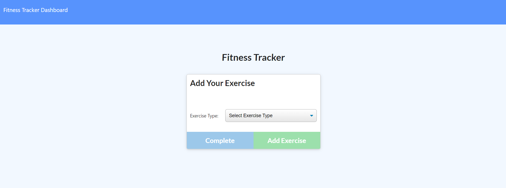
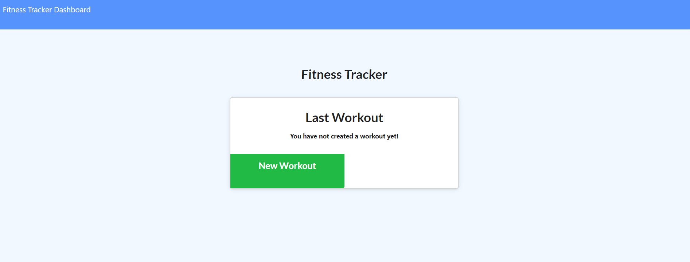
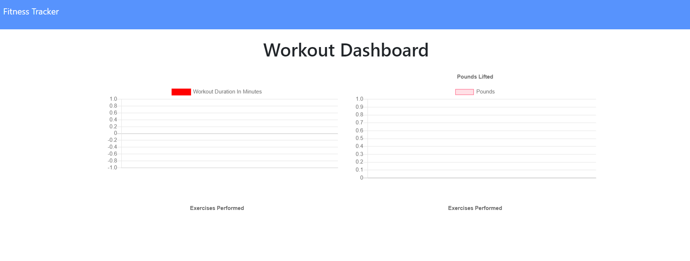

# Fitness-Tracker

## Description

The app allows us to keep track and update our workouts.

## Technologies Used

JavaScript, Node.js, Express, CSS, mongoDB, Mongoose, indexedDB 

## Screenshots

## Links

### Heroku

https://shielded-forest-96032.herokuapp.com/ 

### Github Repo

https://github.com/Bryan-Thaoxaochay/Fitness-Tracker

## What I Learned

### List
1. Mongoose Schemas

Got practice creating a database and the columns by using schemas.

2. Adding Data via VSCode Seeds

Figured out how to use the JS files to fill in the database with data.

3. Rendering HTML Files

Through previous homeworks, I recalled how to render HTML files onto specific routes. This was done using the .sendFile method.

4. Mongoose CRUD

Was able to create and get info from the database using GET, POST, and PUT methods. However, there were difficulties when info was added to the database.

5. MongoDB Atlas and Heroku Deployment

First time deploying an app on Heroku that uses a MongoDB database. Had to create a MongoDB Atlas account and connect that to Heroku.

## Contact Information

Email: bthaoxaochay@gmail.com
GitHub: https://github.com/Bryan-Thaoxaochay 